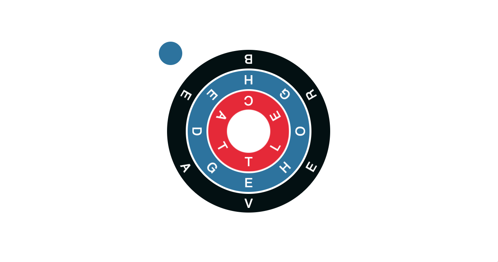
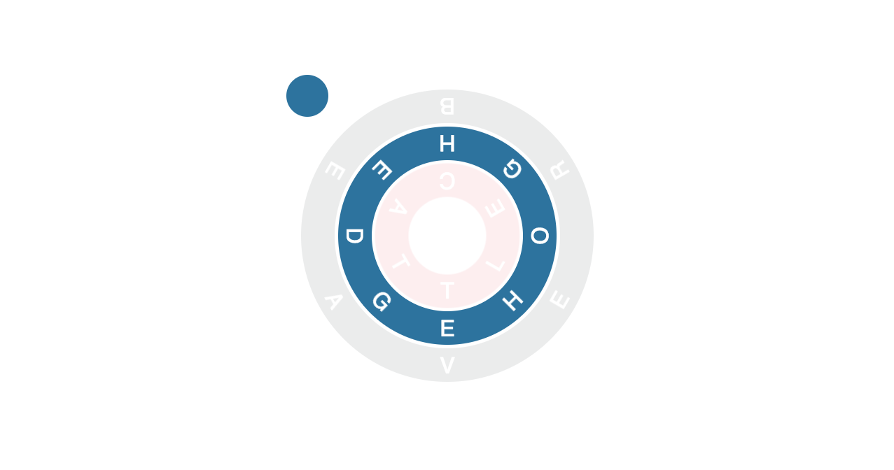
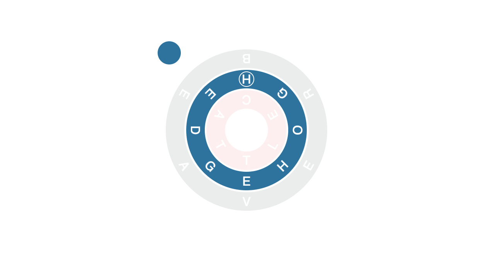
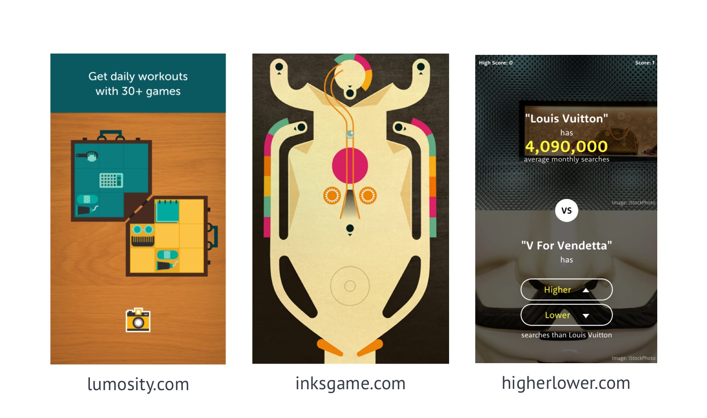
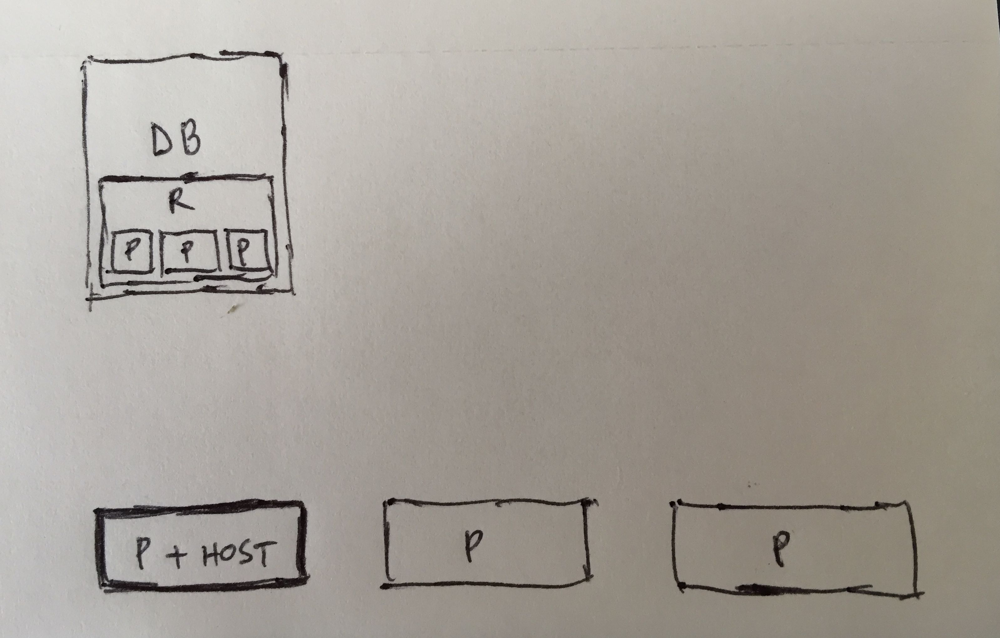
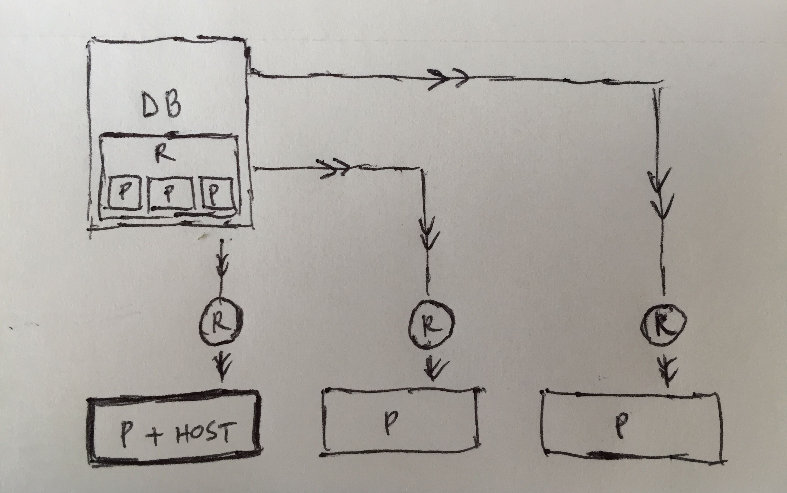
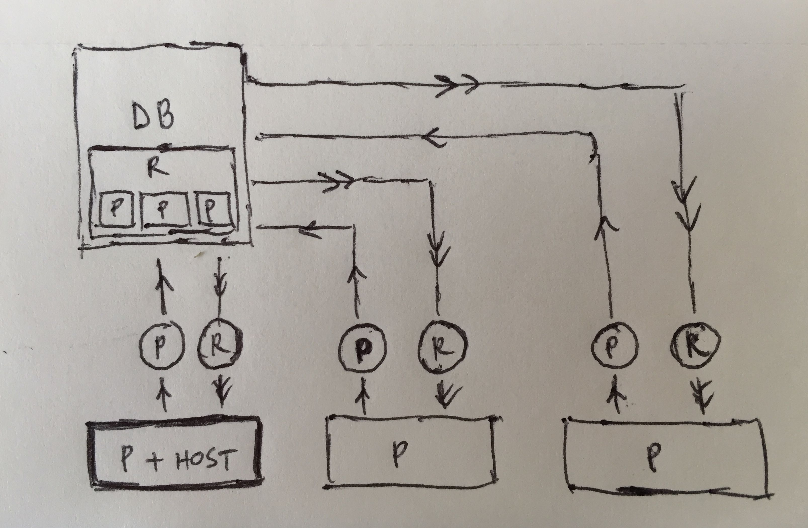
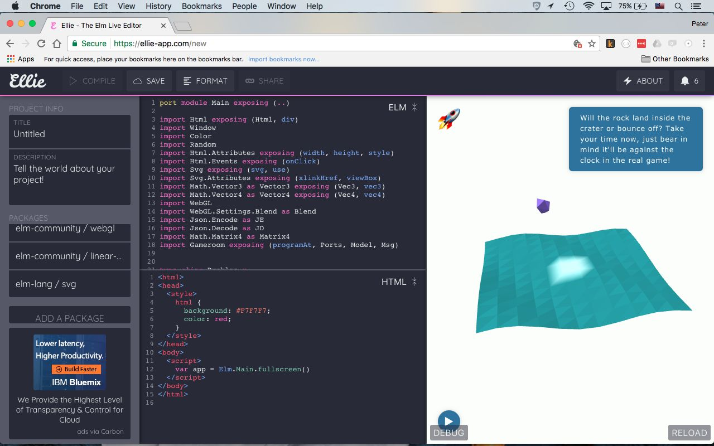

class: center, middle

### 👋

---

class: middle

## On a 🇨🇦 winter evening..

---

class: center, middle



---

class: center, middle



---

class: center, middle



---

class: middle

## Let’s make this for the browser!

---

class: center, middle

<iframe width="768" height="400" src="https://www.youtube.com/embed/ZnQ1M-woDbs?rel=0" frameborder="0" allowfullscreen></iframe>

---

class: middle

## And how about an abstraction?

---

class: center, middle



---

class: center, middle, hero

# Multiplayer guessing games by the boatloads

### Making elm-gameroom

@peterszerzo

---

class: center, middle, hero

# Multiplayer guessing games by the boatloads

### Making elm-gameroom

@peter|s`z`erzo

---

class: middle

## Goals

--
* Define custom views.

--
* Set custom game rules with custom data structures*.

--
* Deploy simply (really simply).

---

class: middle

## Rewind to the original Lettero

--
* `Node.js` back-end: runs the show.

--
* `Elm` frontend: nice-to-have for devX and reliability; lean on logic.

--
* Communicate with websockets.

--

> Oh boy, logic on both client and server..

---

class: middle

### Favorable circumstances

> All players are online at all times!

---

class: middle

### And so..

--
* All clients subscribe to the game room state.

--
* One of them is designated as host.

--
* Host calls the shots and keeps the score.

---

class: center, middle


---

class: center, middle



---

class: center, middle



---

class: center, middle



---

class: center, middle


---

class: middle

### Offloading the back-end

--
* Clients can talk to a logic-less realtime backend like Firebase.

--
* Or just skip the backend and talk through WebRTC.

--

> Elm is more than a nice-to-have now.

---

class: middle

## What is unique to Lettero?

---

class: middle

### 1. Data structure

```elm
type alias Problem = String
type alias Guess = Int

problem : Problem
problem =
    "hedgehog"

guess : Guess
guess =
    1
```

---

class: middle

### 2. View

```elm
view : Context Problem Guess -> Problem -> Html Guess
view context word =
    word
        |> String.toList
        |> List.indexedMap
            (\index letter ->
                span
                    [ onClick index ]
                    [ text (String.fromChar letter) ]
            )
```

---

class: middle

### 3. Logic

```elm
isGuessCorrect : Problem -> Guess -> Bool
isGuessCorrect problem guess =
    guess == 0

problemGenerator : Random.Generator Problem
problemGenerator =
    -- e.g. generate a random entry
    --      from a list of words
```

---

class: middle

### 4. Emigrations

```elm
import Json.Encode exposing (Value, string, int)

problemEncoder : Problem -> Value
problemEncoder =
    string

guessEncoder : Guess -> Value
guessEncoder =
    int
```

---

class: middle

### 5. Immigrations

```elm
import Json.Decode exposing (Decoder, string, int)

problemDecoder : Decoder Problem
problemDecoder =
    string

guessDecoder = Decoder Guess
guessDecoder =
    int
```

---

class: middle

### All together

```elm
type alias Spec =
    { view : Context -> Problem -> Html Guess
    , isGuessCorrect : Problem -> Guess -> Bool
    , problemGenerator : Random.Generator Problem
    , problemEncoder : Problem -> Value
    , problemDecoder : Decoder Problem
    , guessEncoder : Guess -> Value
    , guessDecoder : Decoder Guess
    }
```

---

class: middle

### In the abstract

```elm
type alias Spec problem guess =
    { view : Context guess -> problem -> Html guess
    , isGuessCorrect : problem -> guess -> Bool
    , problemGenerator : Random.Generator problem
    , problemEncoder : problem -> Value
    , problemDecoder : Decoder problem
    , guessEncoder : guess -> Value
    , guessDecoder : Decoder guess
    }
```

---

class: middle

### `elm-gameroom` main API

```elm
program :
    Spec problem guess ->
    Program Never (Model problem guess) (Msg problem guess)
```

---

class: middle

### Setting up

```elm
module Main exposing (..)

import Gameroom exposing (program)

type alias Problem = Anything
type alias Guess = YetAnotherAnything

spec = nuts and bolts of the spec

main = program spec
```

---

class: middle

```elm
module List exposing (..)

-- Any a
filter : (a -> Bool) -> List a -> List a

-- Any a, any b
map : (a -> b) -> List a -> List b
```

---

class: middle

## Some data examples

---

class: middle

```elm
problem =
    { question = "What is the capital of Germany?"
    , answers = [ "Brooklyn, NY", "Berlin, VT", "Berlin" ]
    , correct = 2
    }

guess =
    1

isGuessCorrect problem guess =
    guess == problem.correct
```

---

class: center, middle

<iframe width="768" height="400" src="https://www.youtube.com/embed/Rb05W5L3TTM?rel=0" frameborder="0" allowfullscreen></iframe>

---

class: middle

```elm
problem =
    { incomingAngle = pi / 4
    , deviationFromCorrectPath = 0.0
    }

guess =
    True

isGuessCorrect problem guess =
    if (abs problem.deviationFromCorrectPath < 0.1)
        then guess
        else not guess
```

---

class: center, middle

<iframe width="768" height="400" src="https://www.youtube.com/embed/ADgXtNAbmsE?rel=0" frameborder="0" allowfullscreen></iframe>

---

class: middle

```elm
problem =
    [ { driver = "Toretto"
      , acceleration = 2
      , topSpeed = 1.5
      , engineBlowsAt = Just 0.9
      }
    , ...
    ]

guess =
    "Toretto"
```

---

class: center, middle

<iframe width="768" height="400" src="https://www.youtube.com/embed/8zL6Mb_NrP8?rel=0" frameborder="0" allowfullscreen></iframe>

---

class: middle

## Oh, right, the outside world..

---

class: center, middle


---

class: center, middle


---

class: middle

## Hey, world, let’s talk

--
* Set up some ports.

--
* Set up some generic datastore.

--
* Set up communication between them.

---

class: middle

### Ports?

Elm packages that define their own ports cannot be published!

---

class: middle

### Ports!

```elm
port module Main exposing (..)

import Json.Encode exposing (Value)
import Gameroom

port outgoing : Value -> Cmd msg
port incoming : (Value -> msg) -> Sub msg

ports =
    { outgoing : outgoing
    , incoming : incoming
    }

spec = {}

main = Gameroom.program spec ports
```

---

class: middle

## Talking to ports (just boilerplate!)

```js
// Implementation-specific datastore
import db from '~elm-gameroom/src/js/db/firebase.js'
import talkToPorts from '~elm-gameroom/src/js/talk-to-ports.js'
import Elm from './Main.elm'

const elmApp = Elm.Main.fullscreen()
talkToPorts(db(firebaseApp), elmApp.ports)
```

---

class: middle

## Talking to ports (just boilerplate!)

```js
// Implementation-specific datastore
import db from '~elm-gameroom/src/js/db/webrtc.js' // <-
import talkToPorts from '~elm-gameroom/src/js/talk-to-ports.js'
import Elm from './Main.elm'

const elmApp = Elm.Main.fullscreen()
talkToPorts(db(), elmApp.ports)
```

---

class: middle

### db.js

```js
const db = dependencies => {
  return {
    getRoom (roomId) {},
    createRoom (room) {},
    updateRoom (room) {},
    updatePlayer (player) {},
    subscribeToRoom (roomId) {},
    unsubscribeFromRoom (roomId) {}
  }
}
```

---

class: middle

### Firebase implementation

```js
const db = firebaseApp => {
  const db = firebaseApp.database
  return {
    getRoom (roomId) {
      return db.ref('/rooms/' + roomId).once('value') // ...
    },
    subscribeToRoom (roomId) {
      return db.ref('/rooms/' + roomId).on('value') // ...
    }
    // and so on..
  }
}
```

---

class: middle

## Let’s play some games!

### [elm-gameroom.firebaseapp.com](https://elm-gameroom.firebaseapp.com)

---

class: middle



???
Ellie example is available under https://ellie-app.com/3kf5zPMQY9za1/0.

---

class: center, middle

### 🐣
