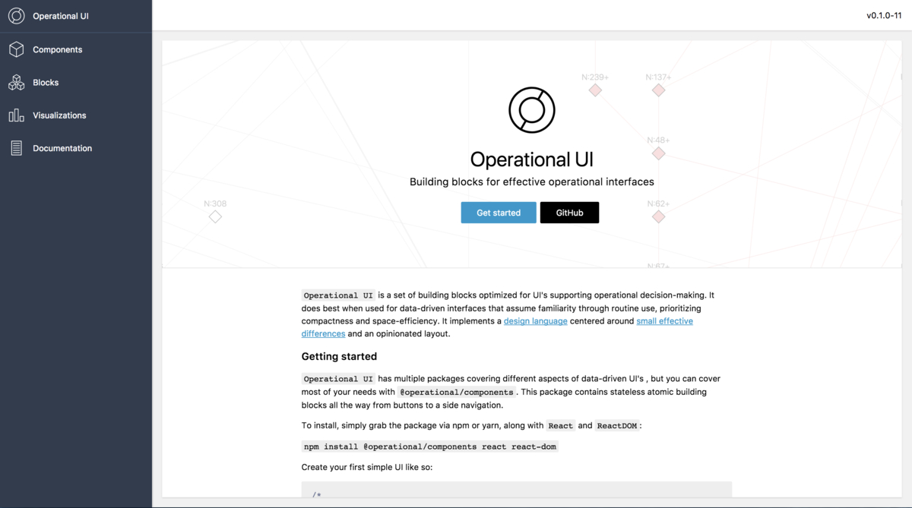
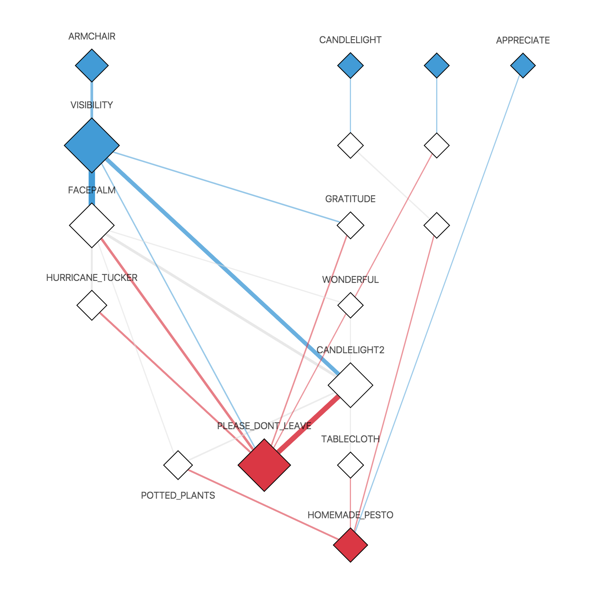
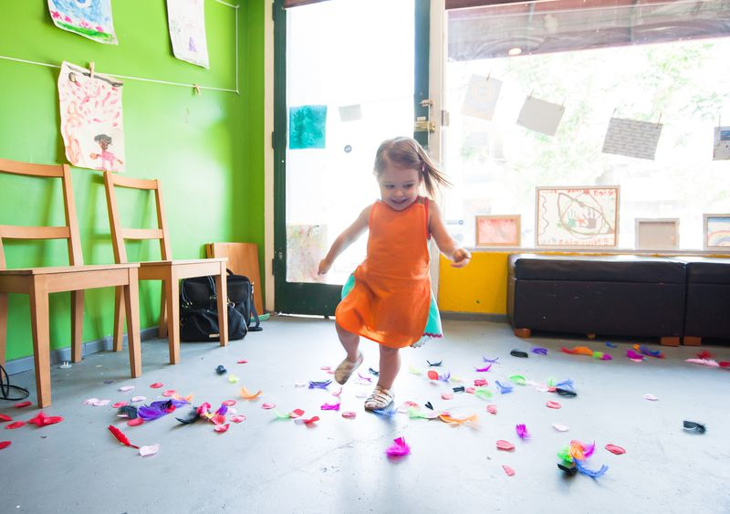
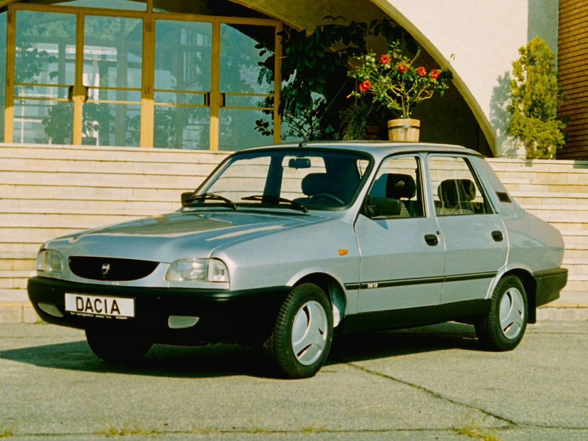
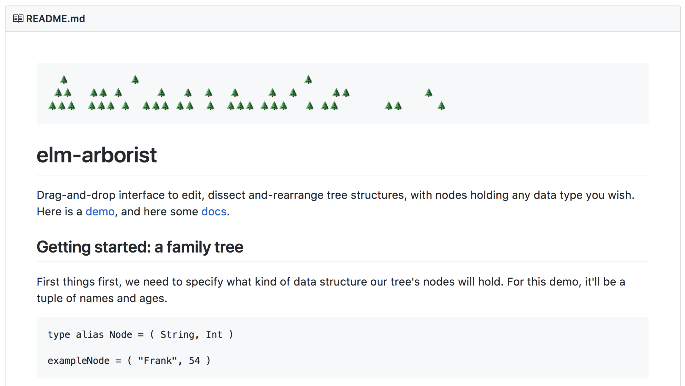

class: center, middle

### 👋

---

class: middle

### Nostalgia!

---

class: middle

```js
React.createElement(
  "button",
  {},
  0
)

```

---

class: middle

```js
<button>
  {0}
</button>
```

--

```js
/*   _______
 *  |       |
 *  |   0   |
 *  |_______|
 */
```

---

class: middle

```js
// Let's increment!
React.createElement(
  "button",
  {
    onClick: () => {
      this.setState({
        count: this.state.count + 1 
      })
    }
  },
  this.state.count
)
```

---

class: middle

```js
<button onClick={() => {
  this.setState({
    count : this.state.count + 1
  })
}}>
  {"Increment me: " + this.state.count}
</button>
```

--

```js
/*   _______      _______
 *  |       |    |       |
 *  |   0   | →  |   1   |
 *  |_______|    |_______|
 */
```

---

class: middle

```js
// Right!
this.state

// Riiiight!
this.props
```

---

class: middle

```js
// First controlled component 🎉
const Input = props => (
  <input 
    value={props.value} 
    onInput={e => props.onChange(e.target.value)}
  />
)
```

---

class: middle

### Rules !!

--

* Keep components under 100/80/50 lines of code

--

* Keep render under 10 lines of code

--

* Server calls in reducers are wrong

--

* Prefer controlled components

--

* Use code splitting

--

* Use immutable data structures

--

* Class component ordering: lifecycle methods, handlers, helpers, render

--

* Don't store things on the component instance

--

* Callback `refs`, callback `setState`

--

* Always bind instance methods in the constructor

--

* The only folder structures that make sense for a React/Redux project are...

--

* Use lazy loading

--

* Use higher-order components

---

class: middle

### Sigh..

---

class: center, middle, hero

# Take your framework dancing

### Assorted React.js pet projects

@peterszerzo

---

class: middle

### Peter Szerzo 

--

* [peter s(z)erzo]

--

* peterszerzo (.com, @, ..)

--

* dev+design at [Contiamo](https://contiamo.com)

---

class: center, middle



https://github.com/Contiamo/operational-ui

---

class: center, middle



https://ui.contiamo.com/visualizations/process-flow

---

class: middle

### Slides

* github.com/peterszerzo/talks
* watch Twitter

---

class: middle

## 1. Functions and lamps

---

class: middle

### Functions

---

class: middle

### Functions 😨

---

class: middle

```js
f(x)

/* --- */

React.createElement(f)
```

---

class: middle

```js
x => g(f(x))

/* --- */

connect(mapStateToProps)(Component)
```

---

class: middle

```js
memoize(f)

/* --- */

shouldComponentUpdate()
```

---

class: middle

```js
const fib = n => {
  if (n === 0) { return 0 }
  if (n === 1) { return 1 }
  return fib(n - 1) + fib(n - 2)
}

/* --- */

// ??
```

---

class: center, middle


---

class: center, middle

<iframe style="background-color: #FFF; border: 0" width="800px" height="600px" src="https://peterszerzo.github.io/splytlight">

---

class: middle

```js
tree = {
  left: {
    left: null,
    right: {
      left: null,
      right: null
    }
  },
  right: null
}
```

---

class: middle

```js
const Units = ({ tree }) => {
  if (!tree) {
    return null
  }
  return (
    <g transform={/* .. */}>
      <Units tree={tree.left} transform={/* .. */} />
      <Units tree={tree.right} transform={/* .. */} />
    </g>
  )
}
```

---

class: middle

```js
const Units = ({ tree, setTree }) => {
  if (!tree) {
    return null
  }
  return (
    <g transform={/* .. */}>
      <Units
        tree={tree.left}
        setTree={changes => {
          setTree({
            left: { ...tree.left, changes }
          })
        }
      />
      {/* .. */}
    </g>
  )
}
```

---

class: middle

## 2. Components and races

---

class: middle

```js
class Something extends React.Component {
  constructor() {}
  render() {}
  componentWillMount() {}
  componentDidMount() {}
  componentWillReceiveProps() {}
  componentWillUpdate() {}
  componentDidUpdate() {}
  componentWillUnmount() {}
}
```

---

class: center, middle



Photo by [Mike Fox](https://unsplash.com/@thefoxicon) on [Unsplash](https://unsplash.com)

---

class: center, middle



---

class: center, middle

<iframe width="800" height="450" src="https://www.youtube.com/embed/MAYWsyDcAPQ" frameborder="0" allow="autoplay; encrypted-media" allowfullscreen></iframe>

---


class: middle

### WebGL..

---

class: middle

```js
// WebGL Adventure: a single ►

const canvas = document.getElementById("mycanvas")
gl = canvas.getContext("webgl")
```

---

class: middle

```js
const vertices = [
  -0.5, 0.5, 0.0,
  -0.5, -0.5, 0.0,
  0.5, -0.5, 0.0, 
];

indices = [0, 1, 2];
```

---

class: middle

```js
const vertexBuffer = gl.createBuffer()
gl.bindBuffer(gl.ARRAY_BUFFER, vertexBuffer)
gl.bufferData(gl.ARRAY_BUFFER, new Float32Array(vertices), gl.STATIC_DRAW)
gl.bindBuffer(gl.ARRAY_BUFFER, null)
```

---

class: middle

```js
const indexBuffer = gl.createBuffer()
gl.bindBuffer(gl.ELEMENT_ARRAY_BUFFER, indexBuffer)
gl.bufferData(gl.ELEMENT_ARRAY_BUFFER, new Uint16Array(indices), gl.STATIC_DRAW)
gl.bindBuffer(gl.ELEMENT_ARRAY_BUFFER, null)
```

---

class: middle

```js
const vertCode = `
attribute vec3 coordinates;
                      
void main(void) {
  gl_Position = vec4(coordinates, 1.0)
}
`

const vertShader = gl.createShader(gl.VERTEX_SHADER)
gl.shaderSource(vertShader, vertCode)
gl.compileShader(vertShader)
```

---

class: middle

```js
const fragCode = `
void main(void) {
  gl_FragColor = vec4(0.0, 0.0, 0.0, 0.1)
}
`
const fragShader = gl.createShader(gl.FRAGMENT_SHADER)
gl.shaderSource(fragShader, fragCode) 
gl.compileShader(fragShader)
```

---

class: middle

```js
const shaderProgram = gl.createProgram()
gl.attachShader(shaderProgram, vertShader)
gl.attachShader(shaderProgram, fragShader)
gl.linkProgram(shaderProgram)
gl.useProgram(shaderProgram)
```

---

class: middle

```js
gl.bindBuffer(gl.ARRAY_BUFFER, vertexBuffer)
gl.bindBuffer(gl.ELEMENT_ARRAY_BUFFER, indexBuffer)
const coord = gl.getAttribLocation(shaderProgram, "coordinates")
gl.vertexAttribPointer(coord, 3, gl.FLOAT, false, 0, 0) 
gl.enableVertexAttribArray(coord)
```

---

class: middle

```js
gl.clearColor(0.5, 0.5, 0.5, 0.9)
gl.enable(gl.DEPTH_TEST)
gl.clear(gl.COLOR_BUFFER_BIT)
gl.viewport(0, 0, canvas.width, canvas.height)

// Gosh finally.. 
gl.drawElements(gl.TRIANGLES, indices.length, gl.UNSIGNED_SHORT, 0)
```

---

class: middle

```js
<Game>
  <Moebius />
  <Car x={0.5} y={0.5} z={1} />
</Game>
```

---

class: center, middle

<iframe style="background-color: #FFF; border: 0" width="800px" height="600px" src="https://peterszerzo.github.io/twisty-donut-racer">

---

class: middle

## 3. Out of `Atom` and up the tree

---

class: middle

## 3. Out of `Vim` and up the tree

---

class: center, middle


Bret Victor - The Humane Representation of Thought (YouTube)

---

class: middle

### Starting a workday in React..

--

* I hope Webpack behaves today..

--

* My prettier plugin broke..

--

* I should probably refactor the folder structure..

---

class: middle

```js
▼ src
  ► components
  ► containers
  ► reducers
  ► actions
  ► epics/sagas/binders/packs
```

---

class: middle

```js
▼ src
  ► components
  ► containers
  ► reducers
  ► actions
  ► epics/sagas/binders/packs
  ▼ utils
      kittens.js
      staplers.js
      bread.js
```

---

class: middle

> Is there a more expressive representation of a UI codebase?

---

class: center, middle

### 🌲

---

class: center, middle



https://peterszerzo.github.io/elm-arborist

---

class: center, middle

### Meet 🥚 Egg

--

https://peterszerzo.github.io/elm-arborist/Egg

---

class: middle

## So..

--

* `React` is permissive and flexible

--

* It runs anywhere you like

--

* Every know and then, it likes to go for a dance 💃 🕺

---

class: center, middle

### 🐣
