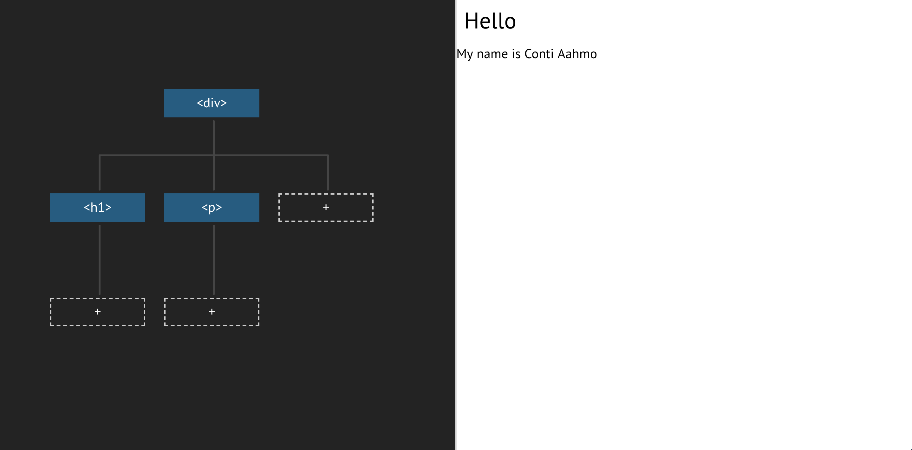

class: center, middle

### 👋

---

class: center, middle, hero

# Put Peter out of work

### Frontend for everybody

---

class: center, middle


---

class: middle

## Contents

--

* HTML, CSS, JavaScript 

--

* React.js

--

* The in-house stuff: Operational UI

---

class: middle

### HTML

```html
<div>
  <h1>Hello</h1>
  <p>My name is Conti Aahmo</p>
</div>
```

---

class: center, middle




---

class: middle

### CSS

```css
h1 {
  color: red;
}
```

---

class: middle

### JavaScript

```js
document
  .querySelector("h1")
  .addEventListener("click", function() {
    alert("clicked")
  })
```

---

class: middle

### A little plain HTML demo

---

class: middle

### That gets real frustrating, real fast..

---

class: middle

## React.js and friends

--

* all in the JavaScript

--

* no need to mutate individual nodes, just specify how it should look based on state

--

* tricky to start with, thank them later!

---

class: middle

### CodeSandbox demo

---

class: center, middle

### 🐣
