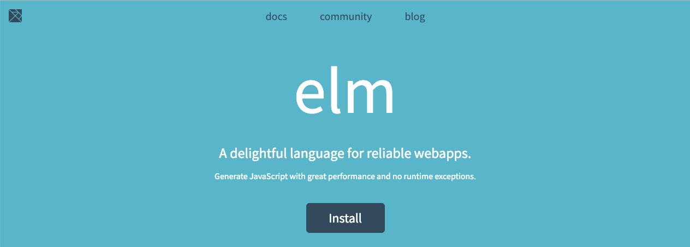
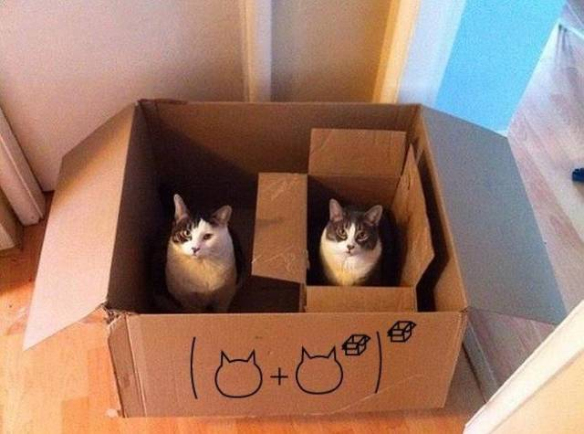

class: center, middle

### 👋

---

class: middle

* kísértetiesen hasonlít a Haskell-re

--

* JavaScript-re kompilál

--

* web frontendre van kifejlesztve

---

class: middle

## Miért?

---

class: middle

* változók: `const`, `Object.assign`

--

* deklaratív: `Array.reduce`

--

* types: `interface Dog { breed: string }`

--

* backend-frontend: `OpenAPI`, `GraphQL`

--

> A JavaScript-tel nincs semmi baj

---

class: middle

* változók: `const`, `Object.assign`

* deklaratív: `Array.reduce`

* types: `interface Dog { breed: string }`

* backend-frontend: `OpenAPI`, `GraphQL`

> Ha runtime hiba kerül egy 50.000 soros frontendbe..

---

class: middle

### Mégis..

--

* `Uncaught TypeError: getSomething is not a function`

--

* `Uncaught TypeError: Cannot read property 'something' of undefined`

---

class: middle

### Moralizáljuk a felelős programozást 💩

---

class: middle

### Garantáljunk egy helyes programot 🎉

---

class: middle, hero

# Bevezető Elm

### Felhasználófelületek garanciákkal

---

class: middle

## Péter

--

`Berlin`

--

`peterszerzo.com`

--

`twitter.com/peterszerzo`

--

`contiamo.com`

--

`nlx.ai`

---

class: middle

### `introelm.peterszerzo.com`

---

class: center, middle



---

class: middle

```elm
someNumber : Int
someNumber =
  5

double : Int -> Int
double no =
  2 * no

doubleTheNumber =
  double someNumber
```

---

class: middle

```js
function double(x) {
  // doSomethingReallyWeird()
  return 2 * x
}
```

```elm
double : Int -> Int
double no =
  2 * no
```

---

class: middle

```js
const arr = [ 1, 2, 3 ]

let sum = 0

for (i = 0; i < arr.length; i++) {
  // doSomethingReallyWeird()
  sum += arr[i]
}
```

---

class: middle

```js
[ 1, 2, 3 ].reduce((accumulator, current) => {
  // doSomethingReallyWeird()
  return current + accumulator
}, 0)
```

---

class: middle

```elm
List.foldl
  (\a b -> a + b)
  0
  [ 1, 2, 3 ]
```

---

class: middle

```elm
module Main exposing (main)

import Html exposing (div, text)
import Html.Attributes exposing (style)

main =
  div
    [ style "color" "red"
    ]
    [ text "Hello, World!"
    ]
```

---

class: middle

```jsx
<div style={{ color: "red" }}>
  "Hello, World!"
</div>
```

---

class: middle

## Élő példák

--

* mutatunk egy kis HTML-t (macskákkal)

--

* egy egyszerű app

--

* kutyafotók 🐩🐶🐕

---

class: center, middle



---

class: middle

## Ha nem dolgozhatunk Elm-ben

[Example](https://codesandbox.io/s/k5po8o1873)

---

class: middle

## Olvasnivalók

--

* [guide.elm-lang.org](https://guide.elm-lang.org/)

--

* [Mostly Adequate Guide to FP](https://mostly-adequate.gitbooks.io/mostly-adequate-guide/)

--

* [LambdaCast](https://soundcloud.com/lambda-cast)

--

* [Learn you a Haskell for great good](http://learnyouahaskell.com/)

--

* [Elm-Conf](https://www.youtube.com/channel/UCOpGiN9AkczVjlpGDaBwQrQ)

---

class: center, middle

### 🐣
