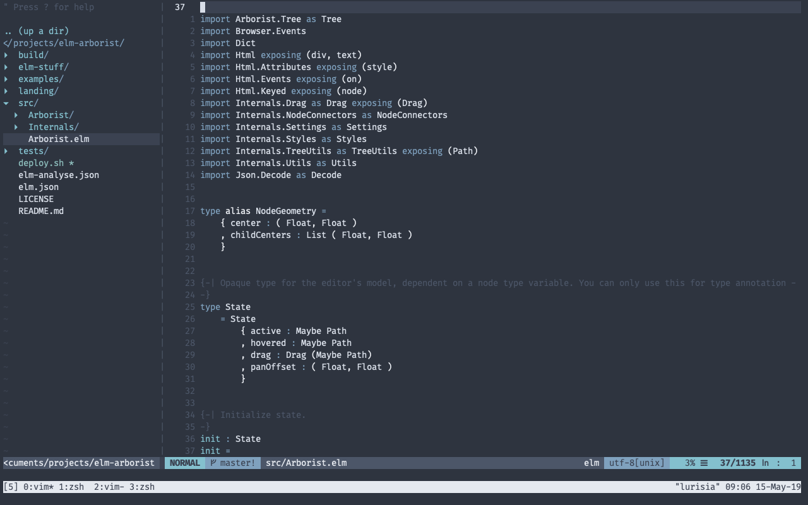
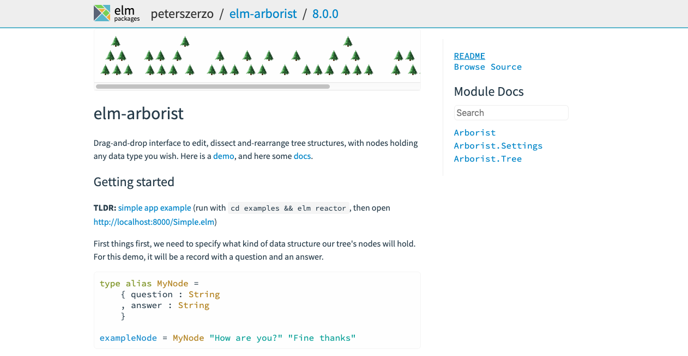

class: center, middle

### 👋

---

class: middle

### I code in a text editor with files and folders

---

class: middle



---

class: middle

> ..it's ok

---

class: middle

## But in a previous life..

<iframe width="768" height="400" src="https://www.youtube.com/embed/DT9Z_tPww1E?rel=0" frameborder="0" allowfullscreen></iframe>

---

class: middle

### Visual programming is great fun

--

- Grasshopper for Rhino

--

- https://cables.gl/

--

- literally tons of other awesome tools

---

class: middle

### ..but often a tricky sell

--

Best stick to the humble tree 🌲

---

class: center, middle, hero

# Rich Tree Editing in Elm

@peterszerzo

---

class: middle

### Peter Szerzo

--

- [peter s(z)erzo]

--

- peterszerzo (.com, @, ..)

--

- dev+design at [NLX](https://nlx.ai)

---

class: middle

### Slides

- https://peterszerzo.github.io/talks
- watch Twitter

---

class: middle

## elm-arborist, v8.0.0

1. Demo
2. API
3. What has changed

---

class: middle

## 1. Demo

https://peterszerzo.github.io/elm-arborist 🌟🌟🌟

---

class: middle

## 2. API

---

class: middle

```elm
arboristSettings : List (Arborist.Setting MyNode)
arboristSettings =
    [ Settings.keyboardNavigation True
    , Settings.defaultNode (MyNode "A" "Q")
    , Settings.nodeWidth 100
    , Settings.level 80
    , Settings.gutter 20
    ]
```

---

class: middle

```elm
type alias MyNode =
  { question : String
  , answer : String
  }
```

---

class: middle

```elm
tree : Tree.Tree MyNode
tree =
    Tree.Node (MyNode "Q1" "A1")
        [ Tree.Node (MyNode "Q2" "A2")
            [ Tree.Node (MyNode "Q3" "A3") []
            ]
        , Tree.Node (MyNode "Q4" "A4")
            [ Tree.Node (MyNode "Q5" "A5") []
            ]
        ]
```

---

class: middle

```elm
type alias Model =
    { arborist : Arborist.State
    , tree : Tree.Tree MyNode
    }
```

---

class: middle

```elm
view : Model -> Html Msg
view model =
    Arborist.view []
        { state = model.arborist
        , tree = model.tree
        , settings = arboristSettings
        , nodeView = nodeView
        , toMsg = Arborist
        }
```

---

class: middle

```elm
nodeView : Arborist.NodeView MyNode Msg
nodeView lotsOfInformation maybeNode =
    case maybeNode of
        Just node ->
            text node.question

        Nothing ->
            text "+ add node"
```

---

class: middle

```elm
type Msg
    = Arborist (Arborist.Updater MyNode)
```

---

class: middle

```elm
update : Msg -> Model -> ( Model, Cmd Msg )
update msg model =
    case msg of
        Arborist updater ->
            let
                ( newState, newTree ) =
                    updater model.arborist model.tree
            in
            ( { model
                | arborist = newState
                , tree = newTree
              }
            , Cmd.none
            )
```

---

class: middle

```elm
subscriptions : Model -> Sub Msg
subscriptions model =
    Arborist.subscriptions arboristSettings model.arborist model.tree
        |> Sub.map
            (\( newState, newTree ) ->
                Arborist (\_ _ -> ( newState, newTree ))
            )
```

---

class: middle

## 3. What has changed

--

* no more `Model`, `Msg`, `update`, `view`

--

* `Arborist.Model -> Arborist.State` + refactor

--

* features to handle large trees: keyboard nav and clustering

---

class: middle



---

class: center, middle

### 🐣
